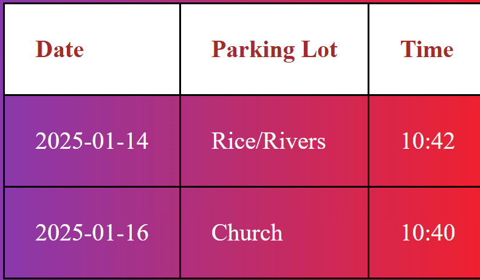
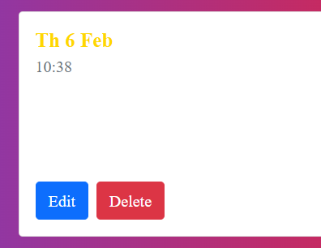
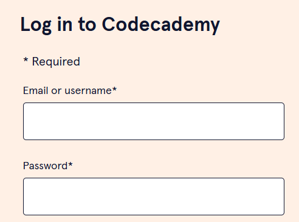

# Dev-George Parking App

## Authorship
- Author: Tatum Duthu

## Attribution
- https://www.codingnepalweb.com/make-simple-login-form-html-css/
- https://github.com/barrycumbie/jubilant-garbanzo-easy-read/blob/main/scripts/readParkingData.js
- https://github.com/ReedWillis/dev-easy-group-project/tree/main
- 

## User Story
As an IT student currently in a web development course I wanted to make 
an app to track where and when I am parking on campus so that I get an 
idea of where the best places to park are depending on the time of day!

## Narrative
-The use of this app is to track what time i got to campus, the date, the 
parking lot, and any other additional information--for example, maybe how 
long it too me to find a parking spot since it takes AWHILE sometimes...

-This project has been a work in process, since I began it In late January
2025 for my first web development project. Since I am at the end of this 
course now, we have revisited this project to upgrade it with all the 
cool new things we have learned.

### Code Snippet: original project
This is code for the original project that I did. Once you filled out the data
it got stored in a table like this:


```json
<table id="parkingTable">
  <thead>
    <tr>
      <th>Date</th>
      <th>Parking Lot</th> 
      <th>Time</th>                  
      <th>Additional Info</th>                  
    </tr>                    
  </thead>                   
  <tbody>
    <tr>
      <td>2025-01-14</td>                   
      <td>Rice/Rivers</td>                  
      <td>10:42</td>                  
      <td>Rainy, cold day</td>     
    </tr>                   
    <tr>                   
      <td>2025-01-16</td>                   
      <td>Church</td>                  
      <td>10:40</td>                  
      <td>Clear, sunny, chill day</td>                       
    </tr>
  </tbody>
</table>

```

### New for this project
Instead of putting the information into the table, I changed it to 
put the data into cards. I felt like this was easier to put the edit 
and delete buttons. (I also already had code to make cards from 
previous projects in this class)


## Real ex. log in
Here is a real example log in that I think is pretty simple. It is from
the website CodeAcademy

I think the log in I used was much more simple though!...

## Code I think is cool
Here is JS code that I think is cool! I think I mostly think this code is cool
because it makes my life a whole lot easier! This code takes the information from 
the json file parkingData.json and prints them off into the cards for me... so
I don't have to go add the information to every single card myself.

```json
function displayParkingData(parkingData) {
        const container = $("#parkingDay");
        container.empty();        

        $.each(parkingData, (index, log) => {
            container.append(`
                <div class="col-md-4 mb-4">
                  <div class="card h-100">
                    <div class="card-body">
                      <h5 class="card-title"><strong>${log.date}</strong></h5>
                      <p class="card-text">Time: ${log.time}</p>
                      <p class="card-text-dark">Note: ${log.note}</p>
                    </div>
                  </div>
                </div>
            `);
        });
    }
```


## Future App Ideas
I think it would be cool to expand on this app to where I have multiple logs. For instance, 
a section of my parking log, a section for a food log, a homework log, etc. It would have 
to be organized better, but I think it would be cool to keep track of daily things like 
this on a web app that I created.

